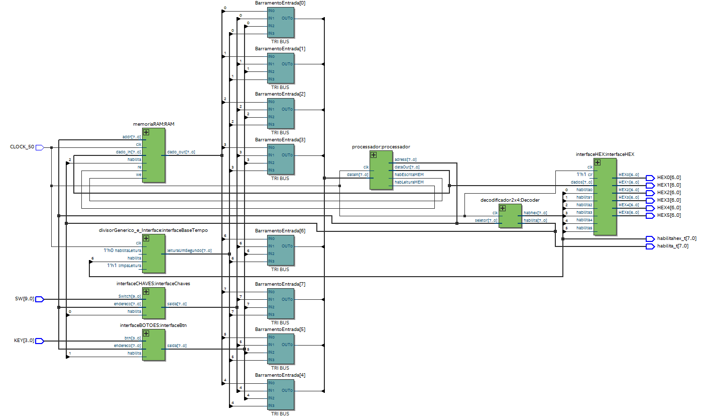

# Projeto 1: Relógio Utilizando um Processador Personalizado
Beatriz Mie Kotsubo Kuwabara, Gabriela Iannini Caruso e Luiza Rodrigues Silveira

### Diagrama de blocos:

### Manual de utilização dos botões e switches da placa DE0-CV:
Switches
  - SW0: seletor da base de tempo.
Botões
  - KEY0: zera o relógio;
  - KEY1: incrementa unidade de minuto;
  - KEY2: incrementa unidade de hora.
LEDs
  - LEDR0: acende quando o seletor acelerado estiver selecionado

### Complementos
Um vídeo ilustrativo pode ser encontrado em: https://youtu.be/uP9GNXL_keQ
